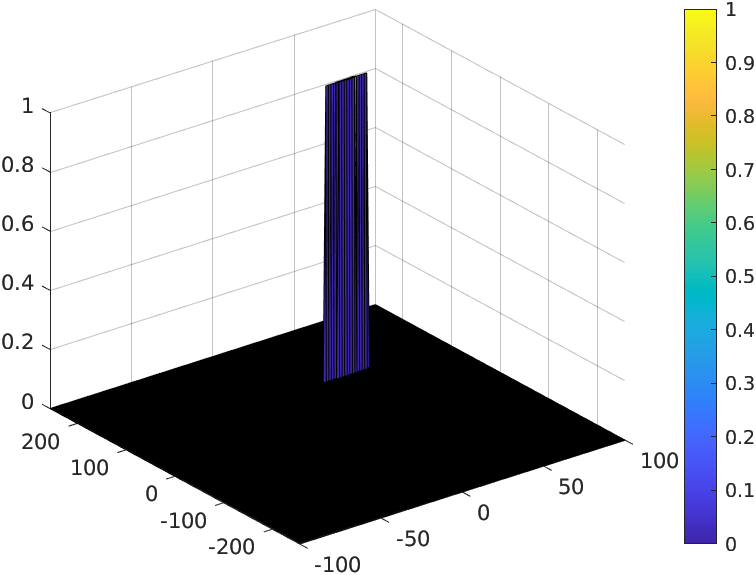

# SFND Radar Target Generation and Detection 

Course project for Udacity Sensor Fusion Engineer Nanodegree Program

Summary of the project is as follows
* Configure the FMCW waveform based on the system requirements.
* Define the range and velocity of target and simulate its displacement.
* For the same simulation loop process the transmit and receive signal to determine the beat signal
* Perform Range FFT on the received signal to determine the Range
* Towards the end, perform the CFAR processing on the output of 2nd FFT to display the target.
 
 
 

## FMCW Waveform Design

### Radar Specifications 

```

%% Radar Specifications 
%%%%%%%%%%%%%%%%%%%%%%%%%%%
% Frequency of operation = 77GHz
% Max Range = 200m
% Range Resolution = 1 m
% Max Velocity = 100 m/s
%%%%%%%%%%%%%%%%%%%%%%%%%%%
```

### As per spec we calculate Bandwidth, chrip time, and slope

```
max_range = 200 ;                                       % Max Range = 200m
delta_range = 1 ;                                       % Range Resolution = 1 m
max_velocity = 100 ;                                    % Max Velocity = 100 m/s
speed_of_light =  3e8 ;                                 % speed of light = 3e8
start_range = 110  ;                                    % Target Initial Range
velocity = 40 ;                                         % Target Velocity
B      = speed_of_light / (2 * delta_range)             % Calculate the Bandwidth (B)
Tchirp = 5.5 * (  max_range * 2 / speed_of_light)       % Chirp Time (Tchirp)
slope  = B / Tchirp                                     % Slope of the FMCW

```

### Simulate target vehicle movement
 Max Range and Range Resolution will be considered here for waveform design.
 
 

```
% vehicle's start_range is 110, and velociy is 40.
fc = 77e9 ;                      % Carrier frequency, Hz
Nd=128;                          % #of doppler cells OR #of sent periods % number of chirps
Nr=1024;                         % for length of time OR # of range cells
t=linspace(0,Nd*Tchirp,Nr*Nd);   % total time for samples
%Creating the vectors for Tx, Rx and Mix based on the total samples input.
Tx=zeros(1,length(t));           % transmitted signal
Rx=zeros(1,length(t));           % received signal
Mix = zeros(1,length(t));        % beat signal
%Similar vectors for range_covered and time delay.
r_t=zeros(1,length(t));
td=zeros(1,length(t));

```
 
 


## FFT Operation

* Implement the 1D FFT on the Mixed Signal
* Reshape the vector into Nr*Nd array.
* Run the FFT on the beat signal along the range bins dimension (Nr)
* Normalize the FFT output.
* Take the absolute value of that output.
* Keep one half of the signal
* Plot the output
* There should be a peak at the initial position of the target
 
### FFT 1d 


### FFT 2d 


 
### 2D CFAR process
``` 
Tr = 16;  % number of Training Cells : Range
Td = 12;  % number of Training Cells : doppler
Gr = 8;  % number of Guard Cells : Range
Gd = 6;  % number of Guard Cells : doppler
offset=7; % offset the threshold by SNR value in dB
c_range_cells = Tr + Gr
c_doppler_cells = Td + Gd
start_range = c_range_cells + 1                % Tr + Gr + 1
end_range =  Nr/2 - c_range_cells              % Nr/2 - Tr - Gr
start_doppler = c_doppler_cells + 1              % Td + Gd + 1
end_doppler =  Nd - c_doppler_cells              % Nd - Td - Gd
windw_norm = (2*c_doppler_cells + 1)* (2*c_range_cells + 1) -(Gr*Gd)-1 
CFAR = zeros(size(RDM)); % set all to zero
for range_index = start_range : end_range
    for doppler_index = start_doppler : end_doppler
        %slide and db2pow (conv)
        training_cells = db2pow(RDM(range_index - c_range_cells : range_index + c_range_cells, ...
                                    doppler_index - c_doppler_cells : doppler_index + c_doppler_cells));
        % remove cells outside range
        training_cells(range_index - Gr : range_index + Gr, ...
                        doppler_index - Gd : doppler_index + Gd) = 0;
        % sum , normalize  and do pow2db
        training = pow2db(sum(sum(training_cells)) / windw_norm);
        % add the offset
        threshold = training + offset;
        CUT = RDM(range_index,doppler_index);
        if (CUT > threshold)  % set to 1
            CFAR(range_index,doppler_index) = 1;
        end
    end
end
```

* Number of Training Cells- Range=16 and doppler=12.
* Number of Guard Cells- Range=8 and doppler=6.
* Slide the cell under test across the complete matrix. Make sure the CUT has margin for Training and Guard cells from the edges.
* For every iteration sum the signal level within all the training cells. To sum convert the value from logarithmic to linear using db2pow function.
* Average the summed values for all of the training cells used. After averaging convert it back to logarithmic using pow2db.
* Further add the offset to it to determine the threshold.
* Next, compare the signal under CUT against this threshold.
* If the CUT level > threshold assign it a value of 1.
 
 ### CFAR 


 ### RUN in matlab 
